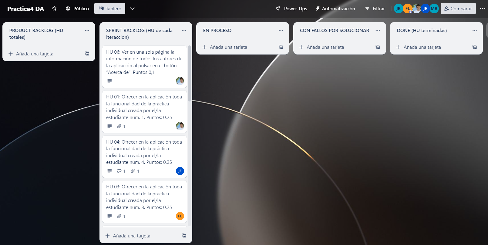
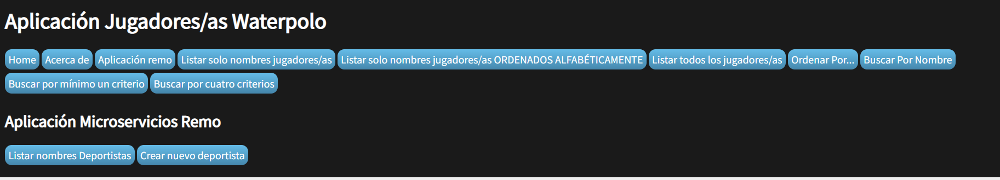
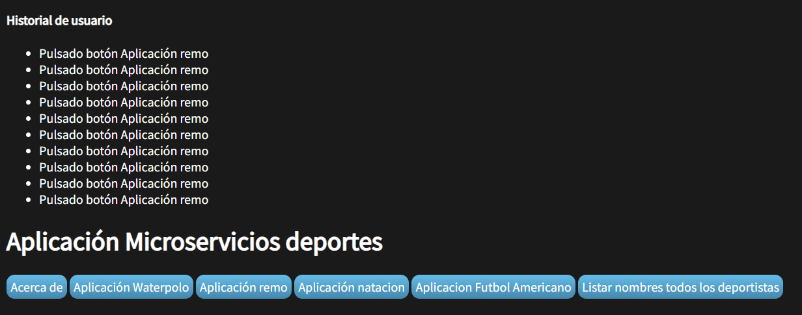
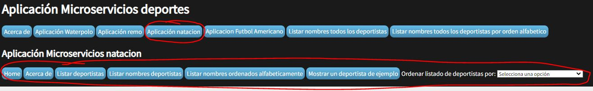
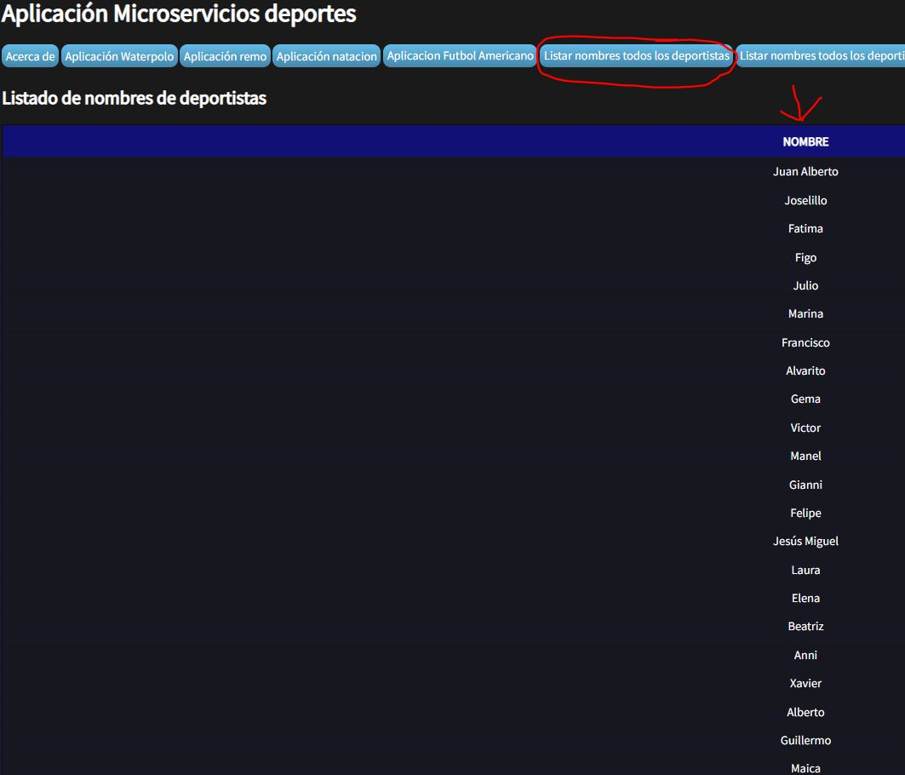
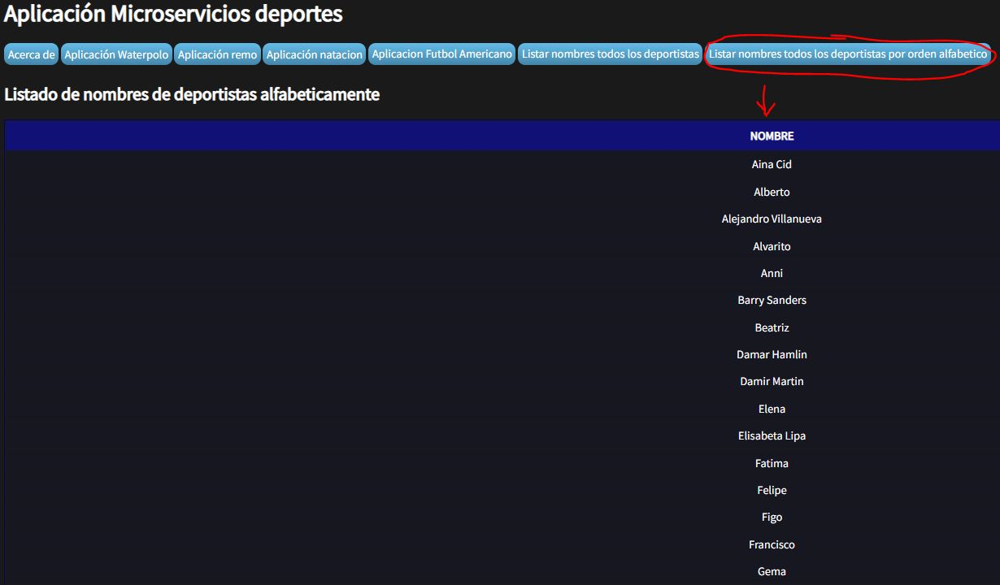
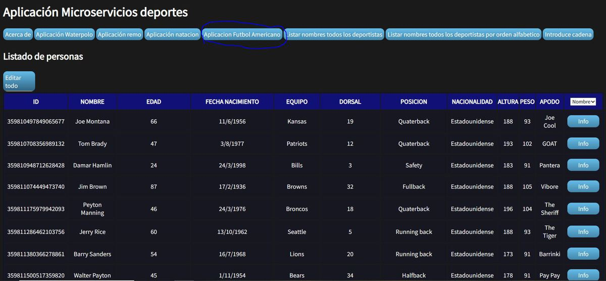
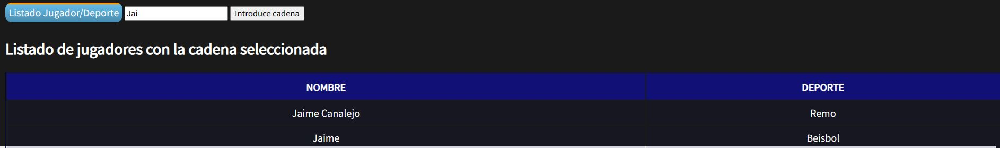
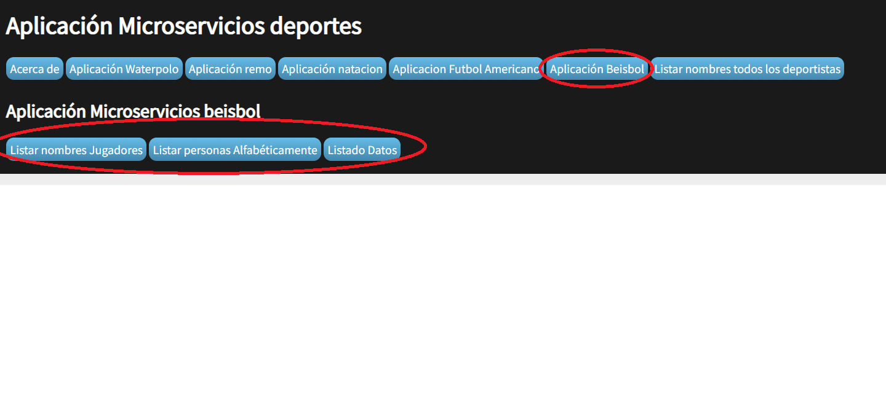

# Práctica 4
## Información del grupo
### Estudiante 1

* **Nombre**: José
* **Apellidos**: Collado Bravo
* **Correo**: jcb00029@red.ujaen.es
### Estudiante 2
* **Nombre**: José
* **Apellidos**: Carpio Blanca
* **Correo**: jcb00034@red.ujaen.es
### Estudiante 3

* **Nombre**: Francisco Javier
* **Apellidos**: Martinez Lomas
* **Correo**: fjml0023@red.ujaen.es
### Estudiante 4

* **Nombre**: Jose Manuel
* **Apellidos**: Gamarra Espinar
* **Correo**: jmge0004@red.ujaen.es
### Estudiante 5

* **Nombre**: Miguel
* **Apellidos**: Liébana Beltrán
* **Correo**:mlb00033@red.ujaen.es

## Enlace al tablero Trello
https://trello.com/b/b3EMiSkn/practica4-da

## Descripción del incremento realizado
### Captura del tablero Trello al principio del Sprint

Como podemos ver, hemos elegido hacer todas las HU del product backlog para este sprint.
Tambien todas las HU han sido asignadas al princio de la siguiente forma:
- El estudiante 1 se encargadra de las historias de Usuario: 01, 06 y 10.
- El estudiante 2 se encargadra de las historias de Usuario: 02 y 11.
- El estudiante 3 se encargadra de las historias de Usuario: 03, 07 y 08.
- El estudiante 4 se encargadra de las historias de Usuario: 04 y 09.
- El estudiante 5 se encargadra de las historias de Usuario: 05.

#### Funcionalidades implementadas por el estudiante 1: José Collado Bravo

HU 01: Ofrecer en la aplicación toda la funcionalidad de la práctica individual creada por el/la estudiante núm. 1. Puntos: 0,25

##### HU_06

##### HU_10

#### Funcionalidades implementadas por el estudiante 2: José Carpio Blanca

##### HU_2
Donde se ofrece de toda la funcionalidad del microservicio Remo:

##### HU_11
Donde se ofrece la funcionalidad de un historial de las ultimas 10 opciones que ha pulsado el usuario en la app.

#### Funcionalidades implementadas por el estudiante 3: Francisco Javier Martinez Lomas

##### HU_3
Donde se ofrece de toda la funcionalidad del microservicio Natacion:

##### HU_07
Donde se ofrece la funcionalidad de un listado con todos los nombres de deportistas de todas las BBDD de los diferentes microservicios:

##### HU_08
Donde se ofrece la funcionalidad de un listado ordenado alfabeticamente con todos los nombres de deportistas de todas las BBDD de los diferentes microservicios:

#### Funcionalidades implementadas por el estudiante 4: Jose Manuel Gamarra Espinar

##### HU_04 Implementación funcionalidad estudiante numero 4
En esta historia de usuario se mete toda la funcionalidad del microservicio Futbol Americano:

##### HU_09: Mostrar nombre y deporte de determinada cadena
Esta historia de usuario tiene por objetivo mostrar el nombre y el deporte de todos los jugadores/equipos que contengan una determinada cadena introducida por el usuario. (Por ejemplo, si el usuario introduce “EST” se mostrarán todos los nombres junto con el deporte practicado de todos los jugadores/equipos cuyo nombre incluya “EST”).

Como usuario quiero ver un listado solo con los nombres de todos los jugadores/as que contengan una determinada cadena para ver el nombre de los/las jugadores/as de la base de datos que contengan una determinada cadena.

Y en la imagen se puede observar que paso la cadena "Jai" y obtengo 2 resultados. Está implementado otro botón Listado Jugador/Deporte, en el que saca todos los jugadores con todos los deportes.

#### Funcionalidades implementadas por el estudiante 5: Miguel Liébana Beltrán

##### HU_05 Implementación funcionalidad estudiante numero 5
Donde se ofrece de toda la funcionalidad del microservicio Beisbol:

