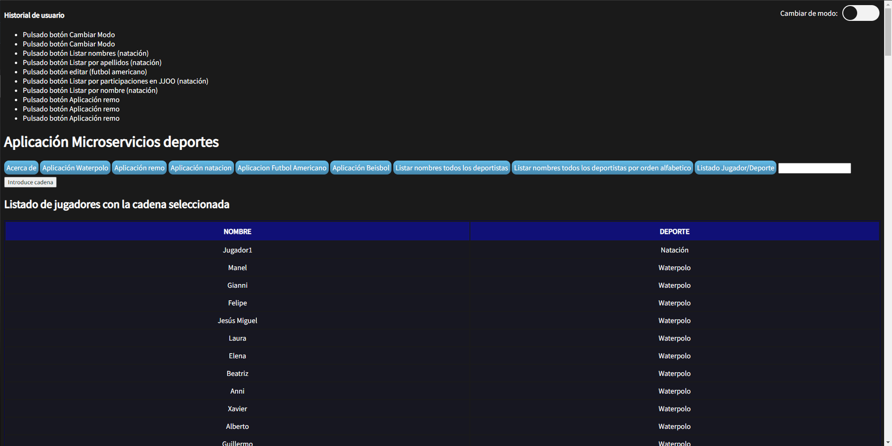

# Práctica 4
## Información del grupo
### Estudiante 1

* **Nombre**: José
* **Apellidos**: Collado Bravo
* **Correo**: jcb00029@red.ujaen.es
### Estudiante 2
* **Nombre**: José
* **Apellidos**: Carpio Blanca
* **Correo**: jcb00034@red.ujaen.es
### Estudiante 3

* **Nombre**: Francisco Javier
* **Apellidos**: Martinez Lomas
* **Correo**: fjml0023@red.ujaen.es
### Estudiante 4

* **Nombre**: Jose Manuel
* **Apellidos**: Gamarra Espinar
* **Correo**: jmge0004@red.ujaen.es
### Estudiante 5

* **Nombre**: Miguel
* **Apellidos**: Liébana Beltrán
* **Correo**: mlb00033@red.ujaen.es

## Enlace al tablero Trello
https://trello.com/b/b3EMiSkn/practica4-da

## Descripción del incremento realizado
### Captura del tablero Trello al principio del Sprint

Como podemos ver, hemos elegido hacer todas las HU del product backlog para este sprint.
Tambien todas las HU han sido asignadas al princio de la siguiente forma:
- El estudiante 1 se encargará de las historias de Usuario: 01, 06 y 10.
- El estudiante 2 se encargará de las historias de Usuario: 02 y 11.
- El estudiante 3 se encargará de las historias de Usuario: 03, 07 y 08.
- El estudiante 4 se encargará de las historias de Usuario: 04 y 09.
- El estudiante 5 se encargará de la historia de Usuario: 05.

#### Funcionalidades implementadas por el estudiante 1: José Collado Bravo

HU 01: Ofrecer en la aplicación toda la funcionalidad de la práctica individual creada por el/la estudiante núm. 1. Puntos: 0,25

HU 06: Ver en una sola página la información de todos los autores de la aplicación al pulsar en el botón “Acerca de”. Puntos 0,1

HU 10: Modificar la visualización de la app con un modo ALTO CONTRASTE. (Es decir: el usuario podrá cambiar entre visualizar la app en el modo normal o en modo ALTO CONTRASTE pulsando solo un botón). Puntos 0,3

#### Funcionalidades implementadas por el estudiante 2: José Carpio Blanca

##### HU_2
Donde se ofrece de toda la funcionalidad del microservicio Remo:

##### HU_11
Donde se ofrece la funcionalidad de un historial de las ultimas 10 opciones que ha pulsado el usuario en la app.

#### Funcionalidades implementadas por el estudiante 3: Francisco Javier Martinez Lomas

##### HU_3
Donde se ofrece de toda la funcionalidad del microservicio Natacion:

##### HU_07
Donde se ofrece la funcionalidad de un listado con todos los nombres de deportistas de todas las BBDD de los diferentes microservicios:

##### HU_08
Donde se ofrece la funcionalidad de un listado ordenado alfabeticamente con todos los nombres de deportistas de todas las BBDD de los diferentes microservicios:

#### Funcionalidades implementadas por el estudiante 4: Jose Manuel Gamarra Espinar

##### HU_04 Implementación funcionalidad estudiante numero 4
En esta historia de usuario se mete toda la funcionalidad del microservicio Futbol Americano:

##### HU_09: Mostrar nombre y deporte de determinada cadena
Esta historia de usuario tiene por objetivo mostrar el nombre y el deporte de todos los jugadores/equipos que contengan una determinada cadena introducida por el usuario. (Por ejemplo, si el usuario introduce “EST” se mostrarán todos los nombres junto con el deporte practicado de todos los jugadores/equipos cuyo nombre incluya “EST”).

Como usuario quiero ver un listado solo con los nombres de todos los jugadores/as que contengan una determinada cadena para ver el nombre de los/las jugadores/as de la base de datos que contengan una determinada cadena.

Y en la imagen se puede observar que paso la cadena "Jai" y obtengo 2 resultados. Está implementado otro botón Listado Jugador/Deporte, en el que saca todos los jugadores con todos los deportes.

#### Funcionalidades implementadas por el estudiante 5: Miguel Liébana Beltrán

##### HU_05 Implementación funcionalidad estudiante numero 5
Donde se ofrece de toda la funcionalidad del microservicio Beisbol:

### Captura de Trello al final del Sprint

### Sprint Retrospective
Durante este sprint, el equipo de trabajo se ha comprometido a implementar todas las HU que se encontraban en el Product Backlog. Esto incluye el desarrollo de una aplicación web de deportes basado en microservicios que incluyen remo, natación, waterpolo, béisbol y fútbol americano.

También se ha realizado de forma continua el Daily Scrum virtualmente donde cada uno respondía a las preguntas sobre qué hice ayer, qué hago hoy y qué problemas estoy teniendo.

#### QUÉ HEMOS HECHO BIEN
Como ya hemos mencionado, se han implementado todas las historias de usuario que estaban en el Product Backlog al principio del incremento. Aunque no hiciese falta toda su implementación, el equipo ha podido distribuir y desarrollar correctamente todo el trabajo debido a la poca complejidad, de forma que se han asignado un mínimo de 2 HU por usuario salvo algunos casos especiales en los que se han asignado 1 o 3.

#### QUÉ HAY QUE MEJORAR
Tanto las historias de usuario 7,8 y 9 están implementadas en 3 botones diferentes, aunque realmente se puede hacer en 1 botón. Realmente este tipo de cosas son más estéticas al mostrarse al usuario que problemas serios de planificación o desarrollo.

Otro punto a mejorar sería la inserción de comentarios dentro del código, ya los comentarios a lo largo del proyecto son nulos, y puede incrementar la curva de aprendizaje de alguien externo que empiece a trabajar en el proyecto a partir del siguiente sprint.

Por último, mencionar también algunos problemas que hemos tenido al principio de la práctica, como por ejemplo que todas las prácticas individuales tenían el mismo espacio de nombres o estaban conectadas al backend bajo los mismos puertos. Estos problemas eran fáciles de resolver con editores de texto pero problématicos si alguno sub´kia su repositorio sin cambiar lo indicado.

#### COMPROMISOS
El equipo de desarrollo se compromete a mejorar los problemas ya mencionados en el anterior apartado, así como establecer fechas límite en las siguientes sprint en la implementación individual de historias de usuario.

También nos comprometemos a corregir e implementar las correciones del profesorado con el objetivo de aumentar la eficacia y eficiencia del código.

Por último, nos comprometemos a la revisión del plan de pruebas desarrollado y mejorarlo en el caso de que fuese insuficiente el número de pruebas realizadas.

### Sprint Review
Como hemos implementado todas las historias de usuario disponibles en el Product Backlog, no hace falta reorganizar el Product Backlog para el nuevo sprint. En el caso de que el equipo de desarrollo se reuniesen de nuevo con los clientes y éstos añadiesen nuevas historias, se pondrían en el Product Backlog del nuevo sprint. 

Si se hubiese dado el caso en el que no se han completado todas las tareas asignadas o algunas elegidas se han quedado sin implementar, se reordenaría el Product Backlog para la siguiente sprint.

Como conclusión, en este incremento se han podido realizar de forma satisfactoria todas las historias de usuario aportando sus correspondientes capturas de pantalla, en el repositorio, más concretamente en este readme están puestas las imágenes del tablero trello del inicio y final asi como las imágenes de las historias correspondientes.
